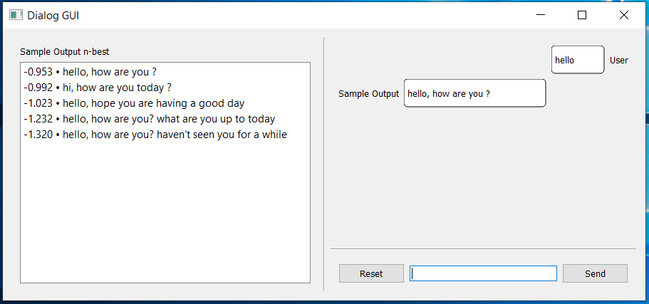

# What does it do?
provides easy Python ways for
*  **evaluation**: calculate automated NLP metrics (BLEU, NIST, METEOR, entropy, etc...)
```python
from metrics import nlp_metrics
nist, bleu, meteor, entropy, diversity, avg_len = nlp_metrics(
	  path_refs=["demo/ref0.txt", "demo/ref1.txt"], 
	  path_hyp="demo/hyp.txt")
	  
# nist = [1.8338, 2.0838, 2.1949, 2.1949]
# bleu = [0.4667, 0.441, 0.4017, 0.3224]
# meteor = 0.2832
# entropy = [2.5232, 2.4849, 2.1972, 1.7918]
# diversity = [0.8667, 1.000]
# avg_len = 5.0000
```
* **tokenizatioin**: clean string and deal with punctation, contraction, url, mention, tag, etc
```python
from tokenizers import clean_str
s = " I don't know:). how about this?https://github.com"
clean_str(s)

# i do n't know :) . how about this ? __url__
```
* **dialog GUI**: provide a graphic user interface (GUI). You just need to provide a `respond()` function.
```python
from dialog_gui import *

def my_respond_func(inp):
        # TODO
        # input: type=str, value=conversation history. turns delimited by 'EOS'
        # return: a list of (score, hyp) tuple based on input
        
app = QtWidgets.QApplication([])
respond_funcs = [my_respond_func]
gui = DialogGUI(respond_funcs, ['my_system_name'])
gui.w.update()
app.exec_()
```



# Requirement
* Tested with Python 2.7 and 3.6
* For GUI, you need PyQt5
* For evaluation part, please **download** the following 3rd-party packages and save in a new folder `3rdparty`
	* **mteval-v14c.pl** (ftp://jaguar.ncsl.nist.gov/mt/resources/mteval-v14c.pl) to compute [NIST](http://www.mt-archive.info/HLT-2002-Doddington.pdf). You may need to install the following [perl](https://www.perl.org/get.html) modules (e.g. by `cpan install`): XML:Twig, Sort:Naturally and String:Util 
	* [**meteor-1.5**](http://www.cs.cmu.edu/~alavie/METEOR/download/meteor-1.5.tar.gz) to compute [METEOR](http://www.cs.cmu.edu/~alavie/METEOR/index.html). It requires [JAVA](https://www.java.com/en/download/help/download_options.xml)


